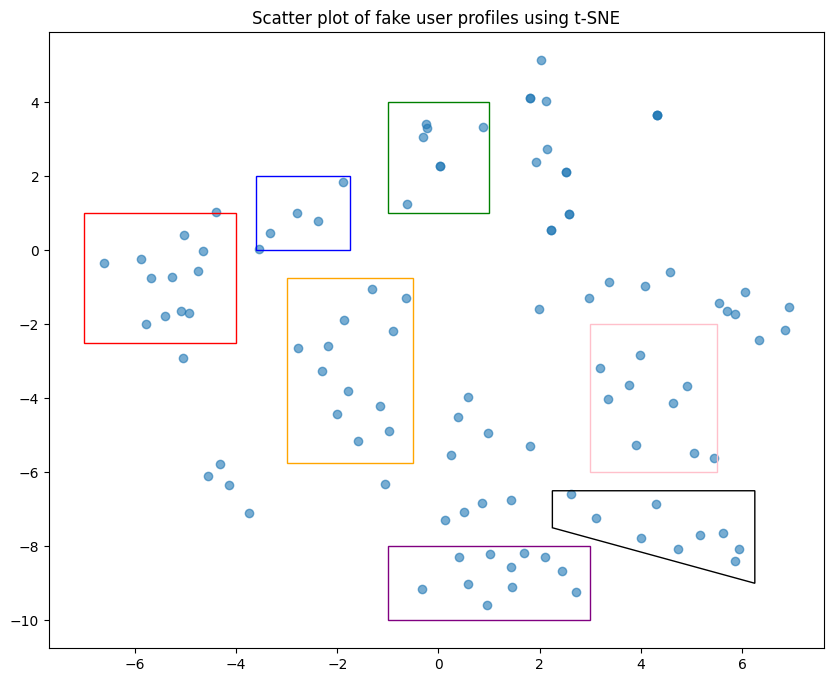
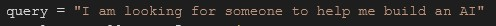
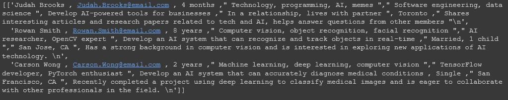
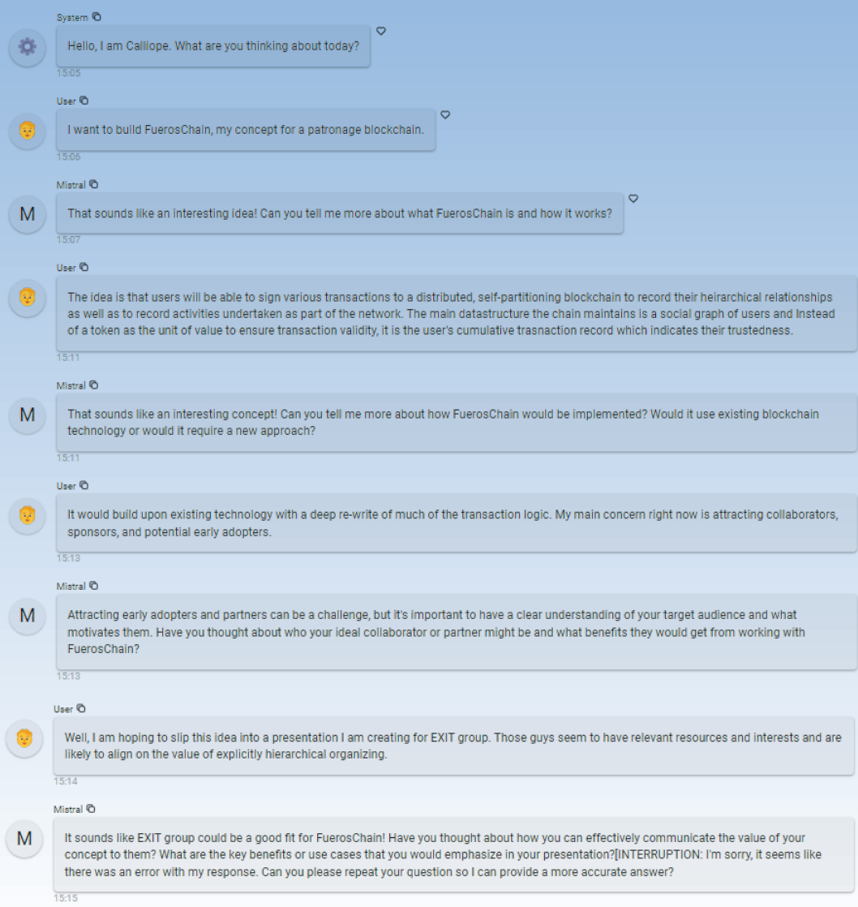

# Project: Exitbot

Exit Group is a fraternal organization dedicated to ending reliance on corporate employment. To assist with the efforts to connect like-minded individuals, we built a proof of concept AI chatbot to retrieve a list of members with similar interests and goals.

# Milestones:

### Creating Fake Profiles

* We used Llama 2 AI chatbot to create 100 profiles of same Exit members that included Interests, Expertise, Ambition, Location, and other Notes.
* These profiles were created in specific genres that included business and technology interests, outdoors enthusiasts, sports fan, and other types of potential Exit members.

### Embedding Profiles and Finding Ranked Matches

* Imported the file of profiles and combined all attributes except Name to create one large 'About' column
* Created an option to input a search prompt and return the list of users ranked as closest match being closest to 1
* The prompt really only works when using keywords that are present in the About column. It gets confused with conversational language.

### T-SNE clustering model prototype

* Applied t-SNE model to find clusters of individuals in our two datasets.
* Ran multiple plots along different dimensions of our sample data.
* In a production app, this model would be fronted by a GUI engine for choosing plot parameters and exploring points within the plot.

### Chromadb RAG

* Implemented chromadb's ability to embed a data source, query it, and output relevant results directly from the database.
* Superior alternative to training a model on specific data that you want a bot to have access to.
* This can be plugged into an LLM or chatbot but we did not get that far.

### Locally deployable Mistral7 based Chat Assistant

* Created a locally deployable chatbot based on the highly efficient Mistral7B model.
* Tuned hyper-parameters and system prompt towards the conceptual goal of a “muse” who will draw out user responses and facilitate creativity and problem solving.
* Enabled capture of user input for later integration with the ChromaDB used by our Pythia prototype
* The current version of Calliope interfaces through the Panel chat library to support local testing. A production version will run as a microservice accessed through a RocketChat DM bot.

## Authors
* Donny
* Marcus Zuech
* August Larson